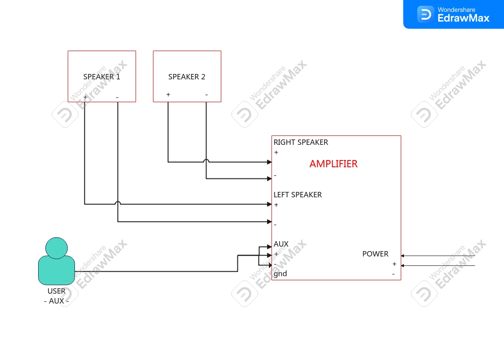

This project is actually quite easy and fun.
Being fun makes it worth to share.
So story time.
    Found this old radio. It has frequency settings but I doubt it's working. I broke it into pieces. Removed the old paint. Sandpapered the surface, and repainted it.
    Ordered some circuit cards. One module that can handle 2 speakers with 4 Ohms and 3W's. It has a aux input and 5 V DC power input.

<picture> 

</picture>