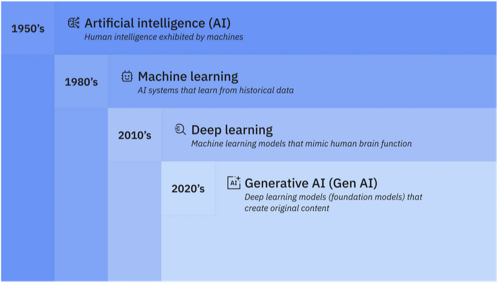
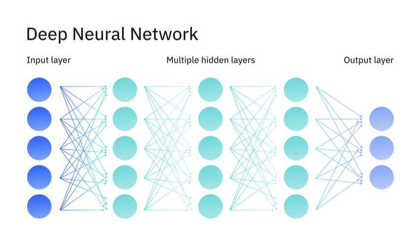

# What is AI - Artificial Intelligence -
https://www.ibm.com/think/topics/artificial-intelligence

Artificial intelligence (AI) is technology that enables computers and machines to simulate human learning, comprehension, problem solving, decision making, creativity and autonomy.

Artificial intelligence (AI) is technology that enables computers and machines to simulate human learning, comprehension, problem solving, decision making, creativity and autonomy.

But in 2024, most AI researchers and practitioners—and most AI-related headlines—are focused on breakthroughs in generative AI (gen AI), a technology that can create original text, images, video and other content. To fully understand generative AI, it’s important to first understand the technologies on which generative AI tools are built: machine learning (ML) and deep learning.

## Machine learning 

<picture> 

</picture>

 <b> Directly underneath AI, we have Machine Learning, which involves creating models by training an algorithm to make predictions or decisions based on data. It encompasses a broad range of techniques thaht enable computers to learn from and make inferences based on data without being explicitly programmed for specific tasks. </b>

There are many types of machine learning techniques or algorithms, including 
- linear regression, 
- logistic regression, 
- decision trees, 
- random forest, 
- support vector machines (SVMs), 
- k-nearest neighbor (KNN), 
- clustering 
and more. Each of these approaches is suited to different kinds of problems and data.

But one of the most popular types of machine learning algorithm is called a neural network (or artificial neural network). Neural networks are modeled after the human brain's structure and function. A neural network consists of interconnected layers of nodes (analogous to neurons) that work together to process and analyze complex data. Neural networks are well suited to tasks that involve identifying complex patterns and relationships in large amounts of data.

The simplest form of machine learning is called supervised learning, which involves the use of labeled data sets to train algorithms to classify data or predict outcomes accurately. In supervised learning, humans pair each training example with an output label. The goal is for the model to learn the mapping between inputs and outputs in the training data, so it can predict the labels of new, unseen data.

## Deep Learning

Deep learning is a subset of machine learning that uses multilayered neural networks, called deep neural networks, that more closely simulate the complex decision-making power of the human brain.

Deep neural networks include an input layer, at least three but usually hundreds of hidden layers, and an output layer, unlike neural networks used in classic machine learning models, which usually have only one or two hidden layers.

These multiple layers enable unsupervised learning: they can automate the extraction of features from large, unlabeled and unstructured data sets, and make their own predictions about what the data represents.

Because deep learning doesn’t require human intervention, it enables machine learning at a tremendous scale. It is well suited to natural language processing (NLP), computer vision, and other tasks that involve the fast, accurate identification complex patterns and relationships in large amounts of data. Some form of deep learning powers most of the artificial intelligence (AI) applications in our lives today.

<picture>

</picture>
Deep learning also enables:

- Semi-supervised learning, which combines supervised and unsupervised learning by using both labeled and unlabeled data to train AI models for classification and regression tasks.

-  Self-supervised learning, which generates implicit labels from unstructured data, rather than relying on labeled data sets for supervisory signals.

-   Reinforcement learning, which learns by trial-and-error and reward functions rather than by extracting information from hidden patterns.

-   Transfer learning, in which knowledge gained through one task or data set is used to improve model performance on another related task or different data set.

## Generative AI 

Generative AI, sometimes called "gen AI", refers to deep learning models that can create complex original content—such as long-form text, high-quality images, realistic video or audio and more—in response to a user’s prompt or request.

At a high level, generative models encode a simplified representation of their training data, and then draw from that representation to create new work that’s similar, but not identical, to the original data.

Generative models have been used for years in statistics to analyze numerical data. But over the last decade, they evolved to analyze and generate more complex data types. This evolution coincided with the emergence of three sophisticated deep learning model types:

- Variational autoencoders or VAEs, which were introduced in 2013, and enabled models that could generate multiple variations of content in response to a prompt or instruction.

- Diffusion models, first seen in 2014, which add "noise" to images until they are unrecognizable, and then remove the noise to generate original images in response to prompts.

- Transformers (also called transformer models), which are trained on sequenced data to generate extended sequences of content (such as words in sentences, shapes in an image, frames of a video or commands in software code). Transformers are at the core of most of today’s headline-making generative AI tools, including ChatGPT and GPT-4, Copilot, BERT, Bard and Midjourney.

### How generative AI works 

In general, generative AI operates in three phases:

-    Training, to create a foundation model.
-   Tuning, to adapt the model to a specific application.
-    Generation, evaluation and more tuning, to improve accuracy.

