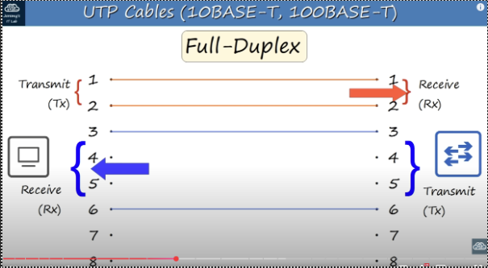

# INTERFACES AND CABLES

<picture> 

</picture>
The most fundamental and essential thing while connecting things is RJ-45 Cable. (a.k.a. Ethernet cable, cat 5, cat6, cat7)
## Ethernet: 
Ethernet is a collection of network protocols/standards.

## Why do we need network standards/protocols?
To make it possible to communicate. Without phsical and logical protocols it would be something like two people trying to speak in different languages.  

## Bits and Bytes
Connections between devices in a network operates at a set speed. These speeds are measured in bits per second.
A bit is either a 0 or a 1.
A byte is equal to 8 bits.
Speed is measured in bits per second like Kbps, Mbps, Gbps, etc. Not bytes per second. It's also worth to note that Data on a hard drive for example is measured in bytes not bits!
<b> This means Gigabyte is 8 times larger than a gigabit<b>

<picture> 

</picture>

## Ethernet Standards

These standards are set by Institute of Electrical and Electronics Engineers a.k.a. IEEE. IEEE 802.3 standard in 1983 

You’ll notice that all ethernet standards start with IEEE 802.3 

<picture> 

</picture>

You can see the standards with their own speed, common name, informal name and the length that the cable can go.

Informal name: numbers are obviously the speed numbers base refers to baseband signaling (not on this leeson) T means twisted pair (also not in this lesson) 

Copper wires that’s used for these speeds are UTP cables – Unshielded  Twisted Pair  

Unshielded means that there is no metalic protection and is vulnerable to damages. It’s twisted because this protects against EMI –Electromagnetic Interference 

There are 4 pairs (8 in total) of copper wires in UTP Cables. Not every standard use every single copper wire. For example 10Base-T and 100Base-T standards use only 2 pairs(4 wires) 

1000Base-T and 10GBase-T use 4 pairs(8wires) 

## Let's connect things!
### Computer - Switch
<picture> 

</picture>

Computers use wire 1 and 2 to Transmit data (Tx) and wire 3 and 6 to Receive data (Rx) 

Switches use wire 1 and 2 to Receive data (Rx) and wire 3 and 6 to Transmit data (Tx) 

This type of transmission is called Full-Dublex Transmission. It allows devices to transmit and receive bits at the same time. No collisions will happen . 

### Router - Switch

<picture> 

</picture>

The wires that’s being used for by the router is the same with pc.  

Connections made with the cables are called Straight-through cable because 1 is connected to 1, 2 is connected to 2, 3 is connected to 3 and so on.

### Switch - Switch

<picture> 

</picture>

In this case we can’t use straight-through cable because it won’t work. The pin protocols doesn’t suit.  

In that case we have a cable type called Crossover. This cable allows us to connect same devices to each other or devices that has the same pins with same protocols. 

<picture> 

</picture>

## Auto MDI - X

It’s worth to note that modern internet devices make it easy to work with because they have cool features. One feature is “Auto MDI-X" this feature allows the device to change the transmit and receive pins so that it can connect easily with a straight-through cable to any device. 

## 1000Base-T & 10GBase-T
On those two protocols all 4 pairs of cables are used(8pairs) 

The best part about these two protocols is that each pair is bidirectional. 
<picture> 

</picture>

## FIBER-OPTIC CONNECTIONS

<picture> 

</picture>

Usually to terminate the Fiber connection you have to use SFP's

<picture> 

</picture>

One cable is to receive and one to transmit
### Multimode
<picture> 

</picture>

Here you can see the layers of the fiberoptic cable

### Singlemode
<picture> 

</picture>

### Fiber-Optic Standards
<picture> 

</picture>

## Diffrences between UTP & Fiber-Optic
<picture> 

</picture>

20251016

# DAY 3 OSI MODEL TCP/IP SUITE

We will concentrate on two networking models
OSI Model
TCP/IP Suite (Also a model but usually called as suite)
Networking models categorize and provide a structure for networking protocols and standards.
Protocol : a set of rules defining how network devices and software should work. 
By the way, protocols refer to logical rules about how devides should communicate not physical standards. 

We need protocols for a internet with all devices and services working together issue-free. For example without protocols and models dell and apple would create it's own model and they would not be able to communicate with each other.

# OSI MODEL
- Open Systems Interconnection Model
- A conceptual model that categorizes and standardizes the different functions in a network.
- Created by the International Organization for Standardization (ISO)
- Functions are divided into 7 Layers
- These layers work together to make the network work.

7- Application			7- Application
6- Presentation			6- Presentation
5- Session			5- Session
4- Transport			4- Transport
3- Network			3- Network
2- Data Link			2- Data Link
1- Physical			1- Physical

## 7- Application
	- This layer is closest to the end user
	- Interacts with software applications, for example your web browser
	- HTTP and HTTPS are layer 7 protocols

	- Functions of Layer 7 Include:
		- Identifying communication partners
		- Synchronizing communication
		let's explain how it gets done: 
here we have two model stacks representing two computers that's communicating with each other.

7- Application			7- Application
6- Presentation			6- Presentation
5- Session			5- Session
4- Transport			4- Transport
3- Network			3- Network
2- Data Link			2- Data Link
1- Physical			1- Physical

The software application, maybe a web browser, interacts with Layer 7, the application layer, and wants to send some data to the other system, computer. This data is processed through the OSI stack each layer adding something to the original data.
This is called "Encapsulation" because the original data is encapsulated inside this additional information which is added on. By the time it reaches the physical layer, it is electrical signals on a wire, and is sent to the neighbor system. then, the neighbor system performs the opposite process, the additions of each layer are stripped off until the data reaches the application layer of the neighbor system. This process is called "de-encapsulation". Both encapsulation and de-encapsulation processes are examples of Adjacent-layer interaction if both application layers communicate with each other directly without going other layers, it's called "Same-layer interaction" 

	
## 6- Presentation
	- Data in the application layer is in "application format" It needs to be "translated" to a different format to be sent over the network.
	- The Presentation Layer's Job is to translate between application and network formats. For example, encryption of data as it is sent, and decryption of data as it's received. 
	- Translates between different application layer formats.

## 5- Session
	- Controls dialogues(sessions)between communicating hosts.
	- Establishes, manages and terminates connections between the local application(for example your web browser) end the remote application (for example, Youtube)

Okay, we have learned these three layers and they are important. But please note that network engineers usually don't work with these layers of the OSI model. 

Let's remember the stack of the model from top to bottom. 7-6-5 these layers prepare the data and then sent over to the bottom 4 layers, which actually do the work of sending it over the network.

## 4- Transport ( DATA (L4 header) )  [segment]
	- Segments and reassembles data for communications between end hosts.
	- Breaks large pieces of data into smaller segments which can be more easily sent over the network and are less likely to cause transmission problems if error occur.
	- Provide host-to-host communication a.k.a end-to-end communication.
	
## 3- Network ( DATA (L4 header)(L3 header)   )   [packet]
	- Provides connectivity between end hosts on different networks (ie. outside of the LAN)
	- Provides logical addressing (IP addressing)
	- Provides path selection between source and destination.
	- Routers operate at Layer 3.	

## 2- Data Link ( (L2 trailer)  DATA  (L4 header)(L3 header) (L2 header)  ) [frame]
	- Provide node to node connectivity and data transfer for example PC to Switch, switch to router, router to router.
	- Defines how data is formatted for transmission over a physical medium for example copper UTP cables
	- Detects and (possibly) corrects Physical layer errors.
	- Uses layer 2 addressing separate from layer 3 addressing,
	- Switches operate at layer 2
## 1- Physical
	- It's the physical layer and defines pyysical characteristics of the medium used to transfer data between devices. For example voltage levels maximum transmission distances physical connectors cable specifications etc.
	- Digital bits are converted into electrical or radio (for wireless connections)
	- All of the information in Day 2's videu cables pin layouts etc is related to the physical layer.

Data, Segment, Packet, and Frame: these are called Protocol Data Units (PDU)s. For example Packet is layer 3 PDU.

# TCP/IP SUITE

	- Conception model and set of communication protocols used in the Internet and other networks
	- Known as TCP/IP because those are T of the foundation protocols in the suite
	- Developed by the United States Department of defence through DARPA
	- Similar structure to the OSI model, but with few layers
	- This is the model actually in use in modern networks
	- Note the OSI model still influences how network engineers think and talk about networks

CCNA 15 RESMI BURAYA GELECEK

When engineers talk about layers it's always the OSI model not the TCP/IP model.
When said issues on layer two, it's OSI Data Link not TCP Internet 

CCNA 16 RESMI BURAYA GELECEK

This topology is perfect for showing how TCP/IP work.

day3 bitti lab incelee

