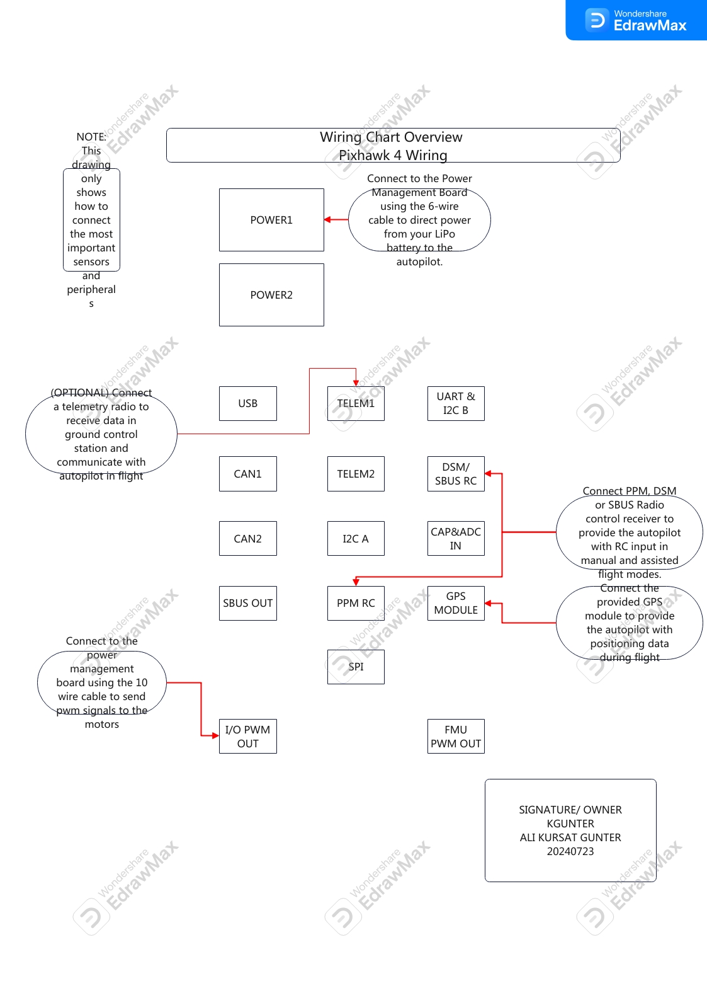

# Drone Experiment ft. Selahattin

> If I only had an hour to chop down a tree, I would spend the first 45 minutes sharpening my axe  

The first question is that what is the path to be taken and how. 
The first question is What do we want to accomplish? - i'm aware there is two first- 

Since we are not starting from scratch I'll list the parts we have and give descriptions for each item. 

# 1 - Pixhawk4 autopilot   
    As far as I understood, this autopilot is attached to the drone as the brain. Every  
    single component is connected to it - directly or indirectly. 
# 2- power management pm02  
    It provides regulated power to flight controller and power distibution board. Also, 
     sends information to the autopilot about battery voltage and current supplied to 
     the  flight controller and motors. photo-no-1 
# 3- ARM adopts high strenght plastics  
    KOL (echolu) 
# 4- Motors -2216 KV880 
    just classic brushless dc motors -hopefully- 
# 5- Propeller 1045 
    pervane (echolu-ustunluk belirtisi) 
# 6- Pixhawk4 GPS   
    ci pi es 
# 7- Fully Assembled Power management board with ESCs  
    coming soon 
# 8- 433 MHz Telemetry Radio/ 915 MHz Telemetry Radio  
    coming soon 
# 9- Power and Radio Cables 
    coming soon 
# 10- Battery Straps 
    coming soon 

# USEFUL LINKS 
Pixhawk 4 Wiring Quick Start [Click Here](https://docs.px4.io/main/en/assembly/quick_start_pixhawk4.html)  
Mainpage for pixhawk [Click Here](https://pixhawk.org)  

# USEFUL BLUEPRINTS
<picture> 

</picture>

# UNKNOWN WORDS
### PPM/SBUS out cable
   Pulse - position modulation >> is a form of signal modulation in wich M message bits are encoded by transmitting a single pulse in one of possible required time shifts. 
### XSR receiver 
### DSMX receiver 
