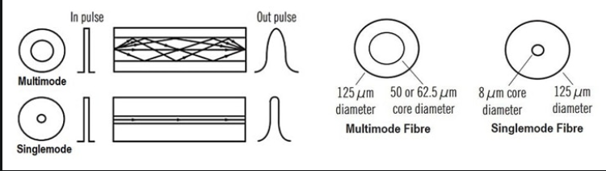
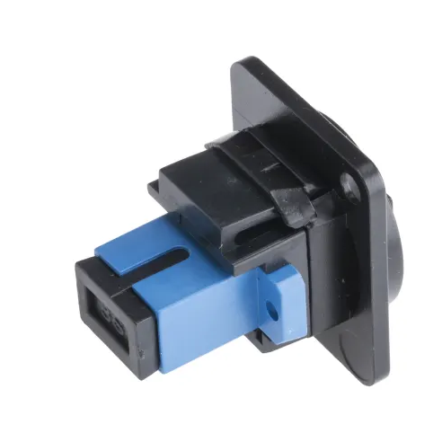
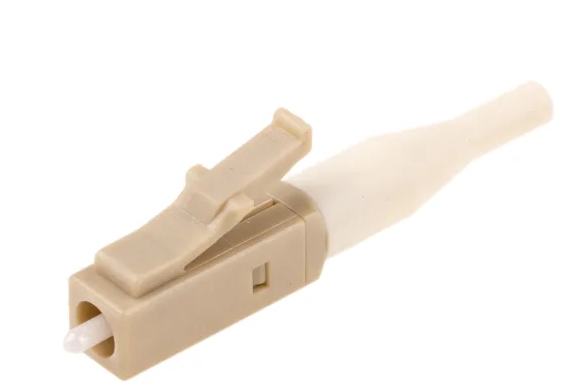
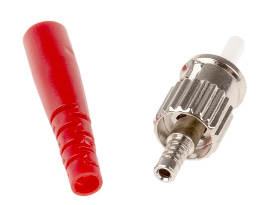
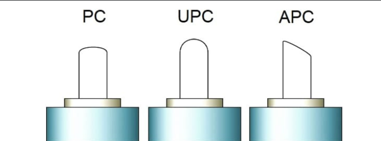

# A Complete Guide to Fibre Optic Cables
RESIMLER YOK
It's an advanced type of network cable. It offers significantly improved performance. 
Optical fibre cabling is used to transfer information via pulses of light. This light is travelling in one or more transparent plastic or glass pipes.
Each of these strands is little wider than an average hair and is normally surrounded by a furhter layer of cladding at a different density to the main inner strand.  A sheath made up of several layers of insulated casing is also wrapped around the cladded fibres. This usually comprises of a protective wrapper, known as a buffer tube, followed by a final outer jacket designed to protect the entire multi-stranded cable.  

Fibre is also safe to use in high voltage locations, and in areas where flammable gases or other harsh chemicals or weather conditions are likely to be a factor.  

# How Do Fibre Optics Work.

In understanding how optical fibres work and how data is sent through optic cables, it's important to note that there are multiple components involved in the construction of optical fibre. All are required to ensure successful fibre optic installation.  
The glass strands themselves are absolutely central to the system, but there is also a number of other key parts that play a role in effective data transfer aling optical fibres. 

Firstly,  a source of light is needed to transmit information pulses along the transparent strands of plastic or glass tubing strands at the cable's core. It's usually created either by a tiny laser or by an LED source.

Secondly, the glass fibres themselves must be surrounded by an additional glass or plastic cladding layer. This one is different from the inner strands.

The rays of light remain inside the transparent fibre cable parts as a result of the reflective internal properties.  At various points, they might be converted into electrical signals before turning back into light pulses again. Additional components called repeaters are used for this and it is done to maintain high signal strength for longer cable runs.  

# How Does Fibre Optic Cable Work

Light enters at one end of the cable and travels through the highly refractive core, bouncing off the cladding which has a low refractive index for this exact reason. Once a beam reaches the end, it is dispersed at an approximately 60° angle and emitted to the target.  
 
<picture> 

</picture>

# Fibre Optic Cable Specification and Characteristics
Optical fibre cabling has numerous key classifications and characteristics. These directly impact its efficiency regarding line speed, signal strength, and bandwidth. 

## Fibre Optic Cable Transmission Speed
Fibre optic data transfer rates are usually reliant on several aspects - chiefly the cable mode. Optical fibres can be configured as either singlemode or multi mode.  However, optical fibre speed is still extremely high regardless of whether you are using a multi-mode or single-mode cable. 

## Fibre Optic Bandwidth 

The bandwidth at a specified wavelength represents the highest sinusoidal light modulation frequency that can be transmitted through a length of fibre with an optical signal power loss equal to 50 percent of the zero modulation frequency component. The bandwith is expressed in megahertz over a kilometer length (MHz/km)

## Attenuation 
The optical attenuation denotes the amount of optical power lost due to absorption and scattering of optical radiation at a specified wavelenght in a length of fibre. It's expressed as an attenuation in decibels of optical power per kilometer(dB/km).  

## Core Diameter
The fibre core is the central region of an opticla fibre whose refractive index is higher than that of the fibre cladding. Various core diameters are available to permit the most efficient coupling of light. There are two basic fibre types; Single mode and Multi mode.
Single mode has a thinner core and multi mode has a thicker core. 
Single faster 
Multi slower 

<picture> 

</picture>

## Cable Construction Selection

Another important consideration when specifying  optical fibre cable is the cable construction. There are three main types: 
- Buffered Fibre Cable
  * Loose Buffer Tube Construction
  * Tight Buffered Distribution Cable
- Simplex Fibre Cable
- Multichannel Fibre Cable
  
### Simplex Fibre Cable
 A simplex fibre optic cable has only one tight buffered optical fibre inside the cable jackets. SImplex fibre optic cables are typically categorised as interconnect cables and are used to make interconnections in front of the patch panel. They are designed for production termination where consistenct and uniformity are vital for fast and efficient operation.

### Multichannel Cable
Building multiple fibres into one cable creates a multichannel cable, This type of cable is usually built with either a central or external strength member and fibre bundled around or within the strength member. An external jacket is used to keep the cable together. 

The major difference between indoor and outdoor fibre optic cable is water blocking. Any conduit is someday likely to get moisture in it. Outdoor cables are designed to protect the fibres from years of exposure to moisture. Indoor cables are what we call “tight-buffered” cables, where the glass fibre has a primary coating and secondary buffer coatings that enlarge each fibre to 900 microns—about 1mm or 1/25-inch, to make fibre easier to work with. 

### NOTE: 
Checking the outer jacket is also important during the selection. Fibre optic cable jackets can provide strength, integrity and overall protection of the fibre member. The standard jacket type of optical cable is called OFNR (Optical Fibre Non-conductive Riser). Fibre optic patch cords are also available with OFNP, or plenum jackets, which are suitable for use in plenum environments such as drop-ceilings or raised floors. The other option for the jacket type is LSZH (Low Smoke Zero Halogen), which is a jacket made from special compounds which give off very little smoke and no toxic halogenic compounds when burned. 

# Fibre Optic Cable Connectors
As with all cables, connectors are required to effectively terminate fibre optic cables. Several different connector types are available and it is important to choose the right one for successful fibre optic connection. This will depend primarily on the equipment and optical fibre in use. 
### SC Connectors
SC connectors are the most widely used variation. They have a 2.5mm ferrule and utilise a straightforward pull-push motion to latch and snap onto the cable. Versatile and efficient, they are used in a wide range of environments.  

<picture> 

</picture>

### LC Connectors 
LC connectors are small and compact, ideal for applications where space is limited. They have a 1.25mm ferrule and are half the size of the standard SC connector.  
<picture> 

</picture>

### ST Connectors
Although ST connectors are still in use, they are now typically used less often than LC and SC connectors. They also have a 2.5mm ferrule but feature a secure bayonet connection.  

<picture> 

</picture>

# Fibre Cable Types 
There are multiple fibre optic cable types, and it is important to understand the differences between each one. 

## Glass Fibre Cable
In terms of bend and flex, glass optical fibre is more delicate than it's plastic counterparts. This also means that it is more susceptible to damage. Especially if it has to loop tightly or be moved continually over it run length. It cannot be cut, repaired, or spliced, which means that it is not suitable for applications where high levels of flexibility are needed. 
Despite this, glass fibre optic cables are sturdy and durable in terms of both mechanical strength and overall resistance to chemicals, moisture, fluctuating temperatures, and extreme environments 

## Single-Mode Cables 
Single-mode and multimode optical fibres are varying cable configuration types. They deliver different potential performance levels at distance. 

Single-mode fibre optic cables are comprised of one glass fibre strand with a fairly slim core diameter. Far less internal reflection is involved as light rays pass through it, therefore reducing attenuation and allowing for far higher speed data transfer over longer distances. This configuration is typically used for long-distance signal transmission. 

## Multimode Cables 
Conversely, multimode cables feature larger cores that guide many modes simultaneously. Multimode fibre cabling significantly increases reflection. This results in higher attenuation and dispersion rates, therefore increasing bandwidth delivery over short distances. Applications needing large data volumes sent over shorter runs (such as communication data in or between a small localised area) typically utilise multimode fibre optic cabling.  
Multimode fibre, also known as multi-core, is available in various specifications. Common everyday networking fibre optic cable configurations include two-core options, eight-core varieties, and even twenty-four-core fibre optic cable. Essentially, the bandwidth potential and the ability to cope with higher data throughput over shorter distances is determined by the number of cores the cable carries. 

# Selecting Fibre Optic Connector
Connector is an integral component of the cabling system. There are various connector types, including LC, FC, ST, SC, MTRJ, MPO, MTP, DIN E2000 etc. To design a fibre optic system, optical connector selection is very important as well. You have to take polishing styles, fibre type, number of fibres, connector body, coupling mechanism and colour code all into consideration.

## Polishing Stlyes: 

There are mainly three kinds of polishing styles, PC (physical contact), APC (angled physical contact), and UPC (ultra-physical contact). 
<picture> 

</picture>

en son nerede kaldik: 

Polishing types'tan sonra fibre types geliyor.

Source : https://uk.rs-online.com/web/content/discovery/ideas-and-advice/fibre-optic-cables-guide?srsltid=AfmBOopWGynFHNIIkgeMQE1W_B4nPOoAxum19auHp4qk9z-UFdDxKE2z 

Buna da bakilabilir :  
https://briticom.net/resources/white-papers/fibre-optic-cables-connectors-guide/ 
